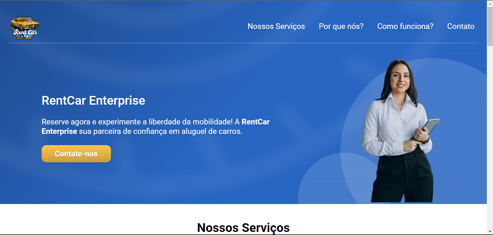

# RentCar Enterprise

Este projeto foi desenvolvido na conclusão dos módulos de HTML e CSS do curso de Desenvolvimento Web. A landing page é dedicada a uma empresa fictícia de aluguel de carros, fornecendo informações básicas sobre os serviços oferecidos.

## Tecnologias Utilizadas

- HTML
  - Semântica
  - Formulários
  - Multimídia
- CSS
  - Mobile-First
  - Responsividade
  - Animações

## Links

- [Deploy](https://emanuelquintino.github.io/RentCar-Enterprise/)
